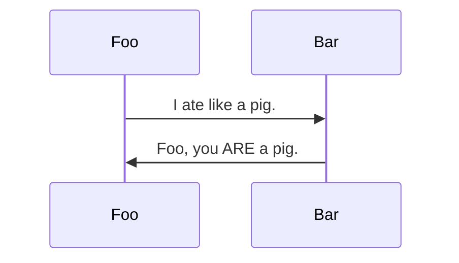

# Style test page

---

Lorem ipsum dolor sit amet, consectetur adipiscing elit. Maecenas egestas dignissim iaculis. Nam tincidunt viverra tempus. Orci varius natoque penatibus et magnis dis parturient montes, nascetur ridiculus mus. Aenean et dui tempus, bibendum orci at, commodo purus. In feugiat sem ac eros condimentum, et egestas dolor dictum. Sed ultricies tortor sed diam efficitur lacinia. Morbi porttitor massa efficitur quam euismod facilisis.

## H2 heading

Donec bibendum vestibulum lacus, sed pellentesque eros efficitur et. Cras finibus eleifend posuere. Curabitur ac enim nunc. Maecenas non porttitor metus. Cras finibus, mi ut elementum placerat, metus ex finibus velit, ac bibendum sem enim a tellus. Nulla in ultricies est. Morbi tincidunt nunc nec risus ultrices, et semper libero varius. Vestibulum ante ipsum primis in faucibus orci luctus et ultrices posuere cubilia curae; Fusce iaculis, nibh et rhoncus vulputate, turpis urna fringilla odio, in tristique quam purus ac metus. In lacinia consequat augue id dapibus. Sed facilisis porta urna. Phasellus malesuada id dui sed vulputate. In id velit lorem.

### H3 heading

Mauris tellus libero, placerat et commodo eget, dapibus ut dolor. Pellentesque consectetur elit lobortis erat tempus bibendum. Donec massa ipsum, rutrum at congue eu, condimentum et metus. Suspendisse fringilla sollicitudin nulla, gravida elementum velit rhoncus viverra. Quisque feugiat posuere tempus. Ut vitae luctus arcu, aliquet tristique urna. Sed leo turpis, interdum a mi in, molestie cursus augue. Mauris blandit hendrerit viverra. Duis felis metus, ornare non enim ac, malesuada condimentum velit. Sed ut est vehicula, fermentum elit vel, ullamcorper justo.

#### H4 heading

Praesent scelerisque sapien eros, nec tempus magna porta ut. Vivamus scelerisque libero a enim pharetra elementum. Integer tellus augue, varius in fermentum vel, tincidunt sit amet enim. Donec et feugiat lorem. Praesent magna lacus, laoreet nec tincidunt non, ornare vitae diam. Praesent ut ornare ante. Suspendisse metus justo, tempor id consequat ut, vehicula vitae augue.

##### H5 heading

Ut dui lectus, euismod placerat auctor eget, blandit in felis. In non pulvinar velit, non convallis ex. Suspendisse massa nulla, aliquam non justo a, blandit imperdiet purus. Morbi vulputate iaculis augue nec bibendum. Interdum et malesuada fames ac ante ipsum primis in faucibus. Nam tortor dui, cursus faucibus tortor sed, dictum commodo neque. Vestibulum elit nisi, faucibus ut dolor eu, scelerisque maximus libero. Sed iaculis metus vitae ultrices porttitor. Aenean efficitur vitae ex eget sollicitudin. Aliquam erat volutpat. Sed at bibendum ante. Nunc at dolor eros. Donec laoreet pharetra sem, sit amet rutrum magna hendrerit sit amet.

###### H6 heading

Smallest heading possible

## Other elements

This is **bold text**

This is _italic text_

### Highlights

> [!NOTE]  
> Highlights information that users should take into account, even when skimming.

> [!TIP]
> Optional information to help a user be more successful.

> [!IMPORTANT]  
> Crucial information necessary for users to succeed.

> [!WARNING]  
> Critical content demanding immediate user attention due to potential risks.

> [!CAUTION]
> Negative potential consequences of an action.

### Math

$\sqrt{3x-1}+(1+x)^2$

$$
\sqrt{3x-1}+(1+x)^2
$$

```math
\sqrt{3x-1}+(1+x)^2
```

### Mermaid Diagrams



### Timestamps

Short Time: <t:1767419999:t>

Long Time: <t:1767419999:T>

Short Date: <t:1767419999:d>

Long Date: <t:1767419999:D>

Short DateTime: <t:1767419999:s>

Long DateTime: <t:1767419999:S>

Relative: <t:1778936700:R>

Short format <t:1767419999:f>

Long format <t:1767419999:F>
